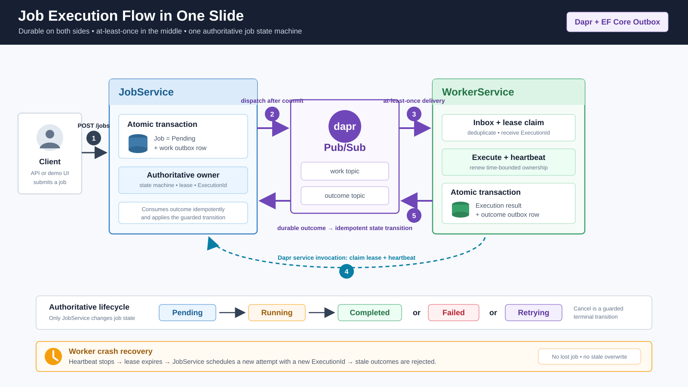
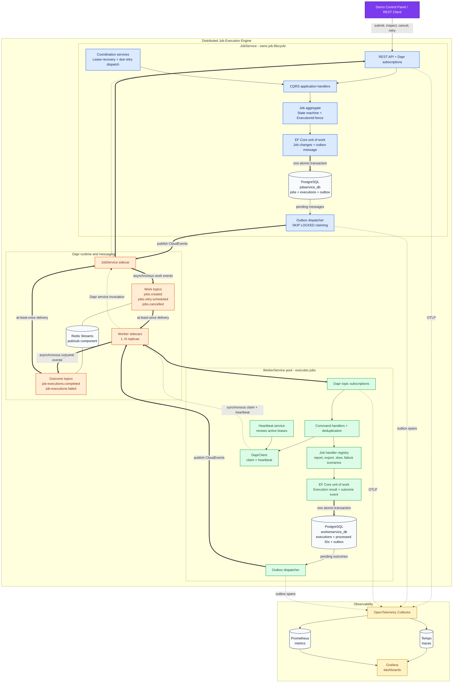
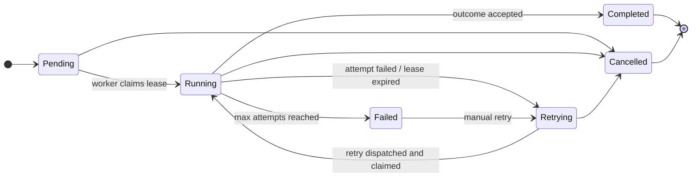
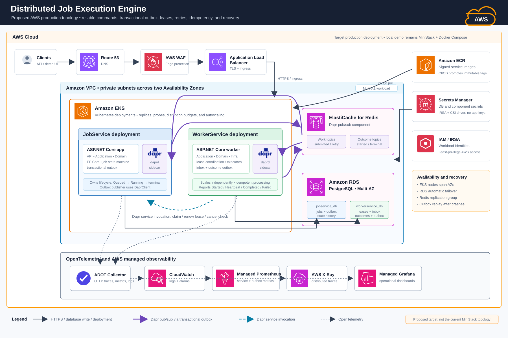

# Distributed Job Execution Engine

A distributed job engine built with **.NET 10**, **Dapr**, and **Entity Framework Core**. It demonstrates the transactional outbox pattern, at-least-once delivery with idempotent consumers, lease-based worker ownership with execution fencing, durable retries, and runtime chaos injection.

The project showcases the [Dapr .NET SDK EF Core Outbox contribution (PR #1863)](https://github.com/dapr/dotnet-sdk/pull/1863): domain state and outgoing Dapr events commit in a single EF Core transaction, and a background dispatcher publishes them reliably via `DaprClient`.



## Architecture



**Blue** is JobService, which owns job state, leases, retries, and execution fencing. **Green** is WorkerService, which executes jobs and reports outcomes through its own outbox. **Orange** is Dapr and Redis Streams. Double arrows mark durable transaction or at-least-once messaging boundaries; dashed arrows are synchronous service invocation and telemetry.

### How It Works

1. **Submit** — A client submits a job through the REST API or demo panel. The job is stored as `Pending`, and a `jobs.created` message is written to the outbox in the same EF Core transaction.
2. **Dispatch** — The outbox dispatcher claims pending rows with `SELECT ... FOR UPDATE SKIP LOCKED` and publishes them as CloudEvents via `DaprClient.PublishEventAsync`. A crash between commit and publish only delays delivery; it never loses the event.
3. **Claim** — Worker replicas receive the event via Dapr pub/sub and deduplicate it by CloudEvent ID. They then call JobService through Dapr service invocation to claim the job. Optimistic concurrency on the PostgreSQL `xmin` row version ensures exactly one worker wins. The winner receives a 30-second lease and a fresh `ExecutionId`.
4. **Execute** — The worker persists its execution record, runs the job handler, and renews the lease with a heartbeat every 10 seconds.
5. **Report** — The worker commits the result and a `job-executions.completed`/`failed` event through its own outbox. JobService accepts the outcome only if its `ExecutionId` matches the active execution; stale outcomes from an earlier attempt are fenced out.
6. **Recover** — A lease recovery scan (every 5s) reclaims jobs whose worker stopped heartbeating. Failed attempts move to `Retrying` with exponential backoff (2^(n-1) s, capped at 60s, plus jitter). A durable retry dispatcher (every 5s) republishes due jobs as `jobs.retry-scheduled`.

### Job Lifecycle



Only JobService changes job state. Every transition is recorded in `job_state_transitions`.

## Technology Stack

| Component | Version |
|---|---|
| .NET | 10.0 |
| Dapr .NET SDK (`Dapr.Client`, `Dapr.AspNetCore`) | 1.15.3 |
| Dapr runtime / CLI | 1.18 |
| Entity Framework Core / Npgsql provider | 10.0.7 / 10.0.1 |
| PostgreSQL | 17 |
| Redis | 7 |
| OpenTelemetry .NET | 1.18.0 |
| Serilog | 4.3.1 |
| FluentValidation | 12.1.1 |
| Grafana / Prometheus / Tempo | 11.4 / 3.1 / 2.6 |

## Project Structure

```
distributed-job-engine/
  packages/
    CleanArchitecture.BuildingBlocks/    # CQRS, Result, Entity, dispatchers
    Dapr.EntityFrameworkCore.Outbox/     # Transactional outbox (from Dapr SDK PR #1863)
    JobEngine.Contracts/                 # Shared integration event DTOs
  services/
    JobService/                          # Job orchestrator (Clean Architecture)
      src/
        JobService.Api/                  # Controllers, Dapr subscriptions, demo panel
        JobService.Application/          # Commands, queries, validators
        JobService.Domain/               # Job aggregate, state machine, retry policy
        JobService.Infrastructure/       # EF Core, outbox, lease recovery, retry dispatch, chaos
      tests/
    WorkerService/                       # Job processor (Clean Architecture)
      src/
        WorkerService.Api/               # Dapr subscriptions, chaos controller
        WorkerService.Application/       # Event handlers, job handler registry
        WorkerService.Domain/            # Worker execution tracking
        WorkerService.Infrastructure/    # EF Core, DaprClient invocation, heartbeat, chaos
      tests/
  deploy/
    compose/                             # Docker Compose infrastructure stack
    dapr/components/                     # Pub/sub and resiliency config
    observability/                       # OTel Collector, Prometheus, Tempo, Grafana
  docs/
    adr/                                 # Architecture Decision Records
    diagrams/                            # Architecture and flow diagrams
    demo-script.md                       # Community call demo walkthrough
```

## Quick Start

### Prerequisites

- [.NET 10 SDK](https://dotnet.microsoft.com/download/dotnet/10.0)
- [Docker Desktop](https://www.docker.com/products/docker-desktop/) with Docker Compose
- [Dapr CLI](https://docs.dapr.io/getting-started/install-dapr-cli/) 1.18+, initialized with `dapr init --slim`

### 1. Start infrastructure

```bash
docker compose -f deploy/compose/docker-compose.yml up -d
```

| Service | Port | Purpose |
|---|---|---|
| PostgreSQL | 5432 | `jobservice_db` and `workerservice_db` |
| Redis | 6379 | Dapr pub/sub (Redis Streams) |
| Grafana | 3000 | Pre-provisioned dashboard, anonymous access |
| pgAdmin | 5050 | Database browser (login in `docker-compose.yml`) |
| Prometheus | 9090 | Metrics |
| Tempo | 3200 | Traces |
| OTel Collector | 4317 / 4318 | OTLP gRPC / HTTP |

`dapr init --slim` does not start the Dapr placement and scheduler services. Pub/sub works without them, but the sidecars report not-ready until they exist, so run them as containers:

```bash
docker run -d --name dapr_placement --restart always -p 6050:50005 daprio/dapr:1.18.3 ./placement
docker run -d --name dapr_scheduler --restart always -p 6060:50006 -v dapr_scheduler:/var/lock daprio/dapr:1.18.3 ./scheduler --etcd-data-dir=/var/lock/dapr/scheduler --override-broadcast-host-port=localhost:6060
```

### 2. Start services with Dapr sidecars

In VS Code, run the **run-everything** task, which starts the infrastructure and then all services (Terminal > Run Task). **run-all-services** starts only the services. To run them manually:

```bash
# JobService
dapr run --app-id jobservice --app-port 5000 --dapr-http-port 3500 --dapr-grpc-port 50001 --resources-path deploy/dapr/components -- dotnet run --project services/JobService/src/JobService.Api --urls http://localhost:5000

# WorkerService replicas 1-3
dapr run --app-id workerservice --app-port 5101 --dapr-http-port 3501 --dapr-grpc-port 50011 --resources-path deploy/dapr/components -- dotnet run --project services/WorkerService/src/WorkerService.Api --urls http://localhost:5101
dapr run --app-id workerservice --app-port 5102 --dapr-http-port 3502 --dapr-grpc-port 50012 --resources-path deploy/dapr/components -- dotnet run --project services/WorkerService/src/WorkerService.Api --urls http://localhost:5102
dapr run --app-id workerservice --app-port 5103 --dapr-http-port 3503 --dapr-grpc-port 50013 --resources-path deploy/dapr/components -- dotnet run --project services/WorkerService/src/WorkerService.Api --urls http://localhost:5103
```

Both services apply EF Core migrations on startup.

### 3. Open the demo

- **Demo Control Panel**: http://localhost:5000
- **Grafana**: http://localhost:3000
- **pgAdmin**: http://localhost:5050

### Build and test

```bash
dotnet build DistributedJobEngine.Dev.slnx
dotnet test DistributedJobEngine.Dev.slnx
```

## Demo Scenarios

The control panel at http://localhost:5000 submits jobs, shows live job state, and toggles chaos policies on JobService and all worker replicas. The full scripted walkthrough is in [docs/demo-script.md](docs/demo-script.md).

| Job type | Behavior |
|---|---|
| `generate-report` | Succeeds after ~2s |
| `data-export` | Succeeds after ~3s |
| `slow-job` | Runs for a configurable delay (useful for lease and cancel demos) |
| `fail-n-times` | Fails the first `failCount` attempts, then succeeds |
| `always-fail` | Fails every attempt until it reaches `Failed` |

1. **Happy path** — Use **Submit Bulk** and watch jobs flow Pending → Running → Completed across the three workers.
2. **Retry with backoff** — Submit `fail-n-times` with Fail Count 2 and max attempts 4. The job goes Running → Retrying → Retrying → Completed on attempt 3.
3. **Permanent failure and manual retry** — Submit `always-fail`. It exhausts its attempts and lands in `Failed`. Use **Retry** in the jobs table to start it again.
4. **Pause and resume the outbox** — **Pause Outbox**, submit several jobs (committed but not published), then **Resume Outbox**. Every queued event is published and the jobs complete.
5. **Crash after commit** — Enable **Crash After Commit** and submit a job. The transaction commits, but the request fails before a response is returned. The outbox still publishes the event and the job completes.
6. **Worker crash and lease recovery** — Enable **Stop Heartbeat** and submit a `slow-job`. The lease expires after 30s, the recovery scan moves the job to `Retrying`, and another attempt gets a new `ExecutionId`.
7. **Crash after claim** — Enable **Crash After Claim**. A worker wins the claim, then dies before running the handler. No outcome is ever reported, so the lease expires and the job is retried on a new attempt.

## Chaos Endpoints

Both services expose failure injection under `POST /demo/failures/*`:

| Service | Policy | Effect |
|---|---|---|
| JobService | `crash-after-commit` | EF interceptor throws after `SaveChanges` commits |
| JobService | `pause-outbox` / `resume-outbox` | Pauses or resumes the outbox dispatcher |
| JobService | `delay-outbox` | Adds a delay to outbox dispatch |
| JobService | `force-publish-failure` | Forces Dapr publish to throw |
| WorkerService | `crash-after-claim` | Throws after the claim succeeds, before the handler runs |
| WorkerService | `crash-after-effect` | Throws after the handler runs, before the outcome and processed-message marker commit |
| WorkerService | `fail-next-job` | One-shot execution failure |
| WorkerService | `fail-job-type` | N failures for a specific job type |
| WorkerService | `delay-execution` | Adds a delay before job execution |
| WorkerService | `stop-heartbeat` | Stops lease renewal, which triggers recovery |

## Dapr Integration

**Pub/Sub (Redis Streams)** — Both services publish through their EF Core outbox and subscribe with `[Topic]` attributes. JobService publishes `jobs.created`, `jobs.retry-scheduled`, and `jobs.cancelled`; workers publish `job-executions.completed` and `job-executions.failed`. The resiliency policy uses constant retry (2s interval, 3 attempts) plus a circuit breaker (5 failures, 30s timeout).

**Service Invocation** — Workers call JobService with `DaprClient.InvokeMethodAsync`:
- `POST /internal/jobs/{id}/claim` — atomic claim; returns the `ExecutionId` and attempt number
- `POST /internal/jobs/{id}/heartbeat` — lease renewal, fenced by `ExecutionId`

## Observability

All services export OpenTelemetry traces and metrics over OTLP to the collector, which forwards traces to **Tempo** and metrics to **Prometheus**. **Grafana** ships with a pre-provisioned dashboard. Custom metrics cover job throughput, completions and failures, claim conflicts, lease recoveries, heartbeats, duplicates skipped, and stale executions rejected by fencing.

## Production Target (Proposed)

The local demo runs on Docker Compose. The same service boundaries and Dapr components map onto AWS: EKS for compute, ElastiCache for Redis for pub/sub, RDS for PostgreSQL, and ADOT with CloudWatch, Managed Prometheus, X-Ray, and Managed Grafana for observability. See [docs/diagrams/aws-production-architecture.md](docs/diagrams/aws-production-architecture.md) for the details.



## Architecture Decision Records

| ADR | Decision |
|---|---|
| [ADR-001](docs/adr/ADR-001-use-clean-architecture-per-service.md) | Clean Architecture per service |
| [ADR-002](docs/adr/ADR-002-keep-job-state-machine-inside-jobservice-domain.md) | Job state machine in the JobService domain |
| [ADR-003](docs/adr/ADR-003-use-standalone-ef-core-outbox-package.md) | Standalone EF Core outbox package |
| [ADR-004](docs/adr/ADR-004-use-docker-compose-for-local-demo.md) | Docker Compose for the local demo |
| [ADR-005](docs/adr/ADR-005-use-at-least-once-delivery-with-idempotent-consumers.md) | At-least-once delivery with idempotent consumers |
| [ADR-006](docs/adr/ADR-006-use-worker-leases-instead-of-distributed-locks.md) | Worker leases instead of distributed locks |
| [ADR-007](docs/adr/ADR-007-make-contracts-package-optional-for-template.md) | Contracts package optional for the template |
| [ADR-008](docs/adr/ADR-008-use-chaos-middleware-for-failure-injection.md) | Chaos middleware for failure injection |

## Troubleshooting

**Dapr sidecar `/v1.0/healthz` returns 500 (`dapr is not ready`)** — The placement or scheduler containers are missing. Start them with the `docker run` commands in Quick Start.

**pgAdmin, Grafana, or the database hang after Docker Desktop restarts** — Docker Desktop can lose its IPv6 (`::1`) port forwarding after a restart, so connections to `localhost` hang. The services connect to `127.0.0.1` to avoid this. For the browser, use `http://127.0.0.1:<port>`, or restart Docker Desktop and run `docker compose up -d` again.

**Jobs stuck in Pending** — Check that the Dapr sidecars are running (`dapr list`). The outbox dispatcher needs the sidecar to publish.

**Workers not claiming jobs** — Check Redis with `docker compose -f deploy/compose/docker-compose.yml logs redis`, and check the component in `deploy/dapr/components/pubsub.yaml`. If a native Redis already listens on `127.0.0.1:6379`, Dapr uses that one instead of the container.

**Lease recovery not triggering** — A lease must go 30 seconds without a heartbeat before the 5-second recovery scan reclaims it.

**Migration errors or a fresh start** — `docker compose -f deploy/compose/docker-compose.yml down -v` drops the PostgreSQL volume. Both services recreate their schema on the next startup.

## Connection to Dapr .NET SDK PR #1863

The `Dapr.EntityFrameworkCore.Outbox` package is extracted from [PR #1863](https://github.com/dapr/dotnet-sdk/pull/1863) on the Dapr .NET SDK. It:

1. **Captures events inside `SaveChanges`** — Messages enqueued during a unit of work are stored as outbox rows in the same database transaction as the domain changes.
2. **Publishes reliably** — A background dispatcher claims pending rows with `FOR UPDATE SKIP LOCKED` (safe across replicas) and publishes them via `DaprClient.PublishEventAsync`.
3. **Survives failures** — Failed publishes are retried. If the process crashes after commit but before publish, the next poll cycle picks the messages up.

The result is **atomic writes with at-least-once delivery**, the foundation for reliable event-driven microservices with Dapr.
