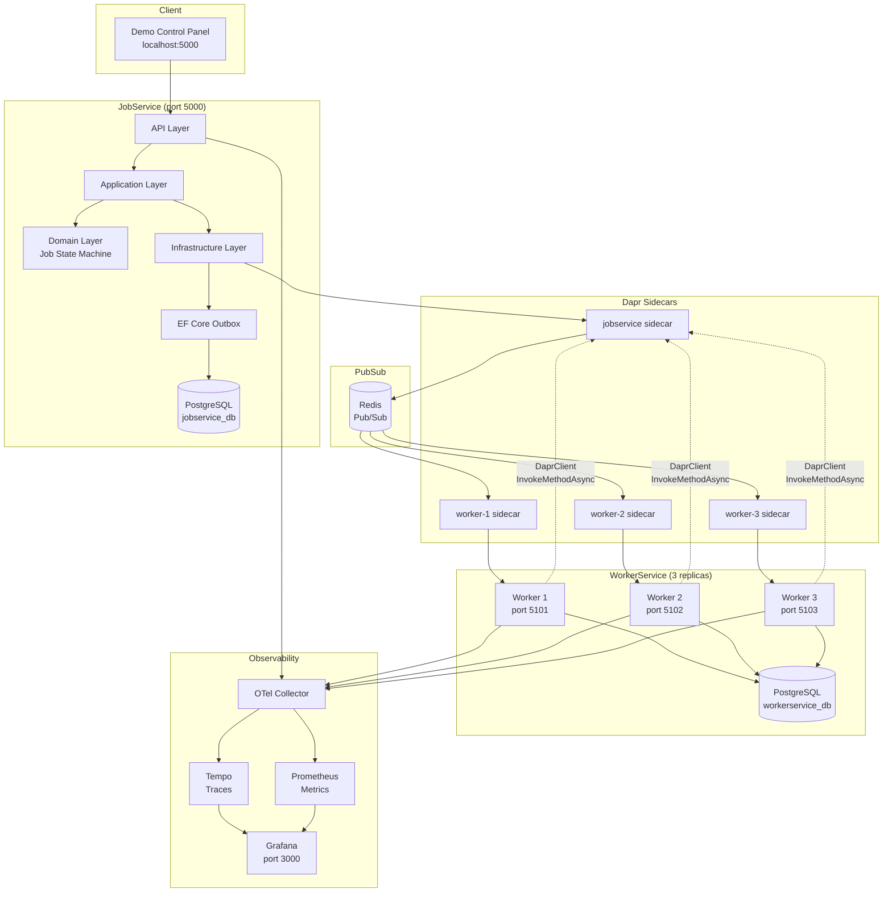

# Distributed Job Execution Engine

A production-grade distributed job engine built with **.NET 10**, **Dapr**, and **Entity Framework Core**, demonstrating the transactional outbox pattern, at-least-once delivery with idempotent consumers, worker leases, and chaos/failure injection.

This project showcases the [Dapr .NET SDK EF Core Outbox contribution (PR #1863)](https://github.com/dapr/dotnet-sdk/pull/1863) — a transactional outbox implementation that atomically commits domain state and outbox messages in a single EF Core transaction, then reliably publishes them via `DaprClient`.

## Architecture



### How It Works

1. **Job Submission** — A client submits a job via the REST API or demo panel. The job is persisted with state `Pending` and a `JobCreated` domain event is atomically enqueued in the outbox within the same EF Core transaction.

2. **Outbox Dispatch** — The `PollingOutboxDispatcher` picks up pending outbox messages and publishes them as CloudEvents via `DaprClient.PublishEventAsync`. Messages are claimed using a PostgreSQL advisory lock strategy to prevent duplicate publishing across restarts.

3. **Worker Claim** — Worker replicas receive the event via Dapr pub/sub, deduplicate by CloudEvent ID, then call back to JobService via `DaprClient.InvokeMethodAsync` to claim the job. Optimistic concurrency (PostgreSQL `xmin` row version) ensures only one worker wins.

4. **Execution & Heartbeat** — The winning worker executes the job handler while sending heartbeats every 10 seconds to maintain the 30-second lease. If the worker crashes, the lease expires and JobService's recovery service reclaims the job.

5. **Outcome Reporting** — On completion or failure, the worker publishes the outcome through its own outbox. JobService consumes this event idempotently and transitions the job to `Completed`, `Failed`, or `Retrying` (with exponential backoff).

## Technology Stack

| Component | Version |
|---|---|
| .NET | 10.0 |
| Dapr SDK | 1.15.3 |
| Dapr Sidecar | 1.14.4 |
| Entity Framework Core | 10.0.7 |
| PostgreSQL | 17 |
| Redis | 7 |
| OpenTelemetry | 1.18.0 |
| Serilog | 4.3.1 |
| FluentValidation | 12.1.1 |

## Project Structure

```
distributed-job-engine/
  packages/
    CleanArchitecture.BuildingBlocks/    # CQRS, Result, Entity, dispatchers
    Dapr.EntityFrameworkCore.Outbox/     # Transactional outbox (from Dapr SDK PR #1863)
    JobEngine.Contracts/                 # Shared integration event DTOs
  services/
    JobService/                          # Job orchestrator (Clean Architecture)
      src/
        JobService.Api/                  # Controllers, middleware, demo panel
        JobService.Application/          # Commands, queries, validators
        JobService.Domain/               # Job aggregate, state machine, retry policy
        JobService.Infrastructure/       # EF Core, outbox, chaos middleware
      tests/
    WorkerService/                       # Job processor (Clean Architecture)
      src/
        WorkerService.Api/               # Dapr subscriptions, controllers
        WorkerService.Application/       # Event handlers, job handler registry
        WorkerService.Domain/            # Worker execution tracking
        WorkerService.Infrastructure/    # EF Core, DaprClient service invocation
      tests/
  deploy/
    compose/                             # Docker Compose stack
    dapr/components/                     # Pub/sub and resiliency config
    observability/                       # OTel Collector, Prometheus, Tempo, Grafana
  docs/adr/                              # Architecture Decision Records (8 ADRs)
```

## Quick Start

### Prerequisites

- [.NET 10 SDK](https://dotnet.microsoft.com/download/dotnet/10.0)
- [Docker Desktop](https://www.docker.com/products/docker-desktop/) (with Docker Compose)

### Run the Full Stack

```bash
docker compose -f deploy/compose/docker-compose.yml up --build
```

This starts:
- **PostgreSQL** (port 5432) with two databases
- **Redis** (port 6379) for Dapr pub/sub
- **JobService** (port 5000) with Dapr sidecar
- **3 WorkerService replicas** (ports 5101-5103) with Dapr sidecars
- **Grafana** (port 3000) with pre-provisioned dashboards
- **Prometheus** (port 9090), **Tempo** (port 3200), **OTel Collector** (port 4317)

### Open the Demo

- **Demo Control Panel**: http://localhost:5000
- **Grafana Dashboard**: http://localhost:3000 (no login required)
- **Prometheus**: http://localhost:9090

### Build and Test Locally

```bash
dotnet build
dotnet test
```

## Demo Scenarios

The demo control panel at http://localhost:5000 provides real-time job submission, monitoring, and chaos injection. Each scenario demonstrates a different reliability pattern.

### 1. Happy Path
Submit 100 jobs via the bulk submit button. Watch all jobs flow through Pending -> Running -> Completed across the 3 worker replicas. Verify zero jobs lost.

### 2. Transactional Outbox Recovery
1. Click **Crash After Commit** on the JobService chaos panel
2. Submit a job — JobService commits the job to the database but crashes before the outbox can publish
3. Click **Deactivate** to clear the chaos policy
4. The outbox dispatcher recovers and publishes the event — the job completes normally

### 3. Worker Crash & Lease Recovery
1. Click **Stop Heartbeat** on the WorkerService chaos panel
2. Submit a job — a worker claims and starts executing, but stops sending heartbeats
3. After 30 seconds, JobService's lease recovery detects the expired lease
4. The job transitions to Retrying and is picked up by another worker

### 4. Duplicate Event Delivery
1. Click **Duplicate Event** on the WorkerService chaos panel
2. Submit a job — the worker receives the event twice
3. The idempotent consumer (ProcessedMessage dedup + state machine) rejects the duplicate with no side effects

### 5. Retry with Exponential Backoff
Submit a job with type **FailNTimesThenSucceed** and max attempts = 5. The handler fails the first N-1 attempts, showing exponential backoff (1s, 2s, 4s...) before finally succeeding.

### 6. Permanent Failure & Manual Retry
Submit a job with type **AlwaysFail**. It exhausts all retry attempts and reaches terminal `Failed` state. Use the **Retry** button in the jobs table to manually retry it.

### 7. Pause & Resume Outbox
1. Click **Pause Outbox** on the JobService chaos panel
2. Submit several jobs — they're committed to the database but events are not published
3. Click **Resume Outbox** — all queued events are published and jobs complete

## Dapr Integration

This project uses Dapr for two building blocks:

### Pub/Sub (Redis)
- JobService publishes domain events via the transactional outbox
- WorkerService subscribes using `[Topic]` attributes with CloudEvents middleware
- Resiliency policy: constant retry (2s interval, 3 attempts) + circuit breaker (5 failures, 30s timeout)

### Service Invocation (DaprClient)
WorkerService calls back to JobService using `DaprClient.InvokeMethodAsync` for:
- `POST /internal/jobs/{id}/claim` — atomic job claim with optimistic concurrency
- `POST /internal/jobs/{id}/heartbeat` — lease renewal

This showcases the Dapr .NET SDK's `DaprClient` for type-safe, sidecar-routed service-to-service communication with built-in retry, mTLS, and observability.

## Chaos Middleware

Both services expose failure injection endpoints under `POST /demo/failures/*`:

| Service | Toggle | Effect |
|---|---|---|
| JobService | `crash-after-commit` | EF interceptor throws after SaveChanges |
| JobService | `pause-outbox` / `resume-outbox` | Outbox dispatcher decorator pauses/resumes |
| JobService | `delay-outbox` | Adds configurable delay to outbox dispatch |
| JobService | `force-publish-failure` | Forces Dapr publish to throw |
| WorkerService | `crash-after-claim` | Command decorator throws post-execution |
| WorkerService | `fail-next-job` | One-shot execution failure |
| WorkerService | `fail-job-type` | N failures for a specific job type |
| WorkerService | `delay-execution` | Adds delay before job execution |
| WorkerService | `stop-heartbeat` | Stops lease heartbeat (triggers recovery) |
| WorkerService | `duplicate-event` | Simulates duplicate event delivery |

## Observability

All services export OpenTelemetry traces and metrics via OTLP to the collector, which fans out to:
- **Tempo** for distributed traces
- **Prometheus** for metrics
- **Grafana** for visualization (pre-provisioned dashboard)

Custom metrics include job throughput, worker activity, heartbeat rates, claim conflicts, and duplicate detection.

## Architecture Decision Records

| ADR | Decision |
|---|---|
| [ADR-001](docs/adr/001-clean-architecture-per-service.md) | Clean Architecture per service |
| [ADR-002](docs/adr/002-job-state-machine-in-domain.md) | Job state machine in JobService Domain |
| [ADR-003](docs/adr/003-standalone-ef-core-outbox-package.md) | Standalone EF Core outbox package |
| [ADR-004](docs/adr/004-docker-compose-local-demo.md) | Docker Compose for local demo |
| [ADR-005](docs/adr/005-at-least-once-delivery-idempotent-consumers.md) | At-least-once delivery with idempotent consumers |
| [ADR-006](docs/adr/006-worker-leases.md) | Worker leases instead of distributed locks |
| [ADR-007](docs/adr/007-contracts-package-optional.md) | Contracts package optional for template |
| [ADR-008](docs/adr/008-chaos-middleware.md) | Chaos middleware for failure injection |

## Troubleshooting

**Services fail to start**: Check that ports 5000, 5101-5103, 5432, 6379, 3000, 9090 are not in use. Run `docker compose down -v` to clean up volumes and try again.

**Jobs stuck in Pending**: Verify the Dapr sidecars are healthy (`docker compose logs jobservice-dapr`). The outbox dispatcher needs the sidecar to publish events.

**Workers not claiming jobs**: Check Redis connectivity (`docker compose logs redis`). Dapr pub/sub requires Redis to be running. Also verify the Dapr component configuration in `deploy/dapr/components/pubsub.yaml`.

**Lease recovery not triggering**: The recovery scan runs every 5 seconds. If a worker holds a lease, it must expire (30 seconds without heartbeat) before recovery kicks in.

**Database migration errors**: Both services auto-migrate on startup. If you see migration conflicts, run `docker compose down -v` to drop the PostgreSQL volumes and restart.

**Grafana shows no data**: Ensure the OTel Collector is running (`docker compose logs otel-collector`). Traces take a few seconds to appear in Tempo. Metrics are scraped by Prometheus every 15 seconds.

## Connection to Dapr .NET SDK PR #1863

The `Dapr.EntityFrameworkCore.Outbox` package in this project is extracted from [PR #1863](https://github.com/dapr/dotnet-sdk/pull/1863) on the Dapr .NET SDK. It implements a transactional outbox pattern that:

1. **Intercepts EF Core SaveChanges** — Domain events raised by aggregates are captured and stored as outbox messages in the same database transaction
2. **Polls and publishes reliably** — A background dispatcher claims pending messages using PostgreSQL advisory locks and publishes them via `DaprClient.PublishEventAsync`
3. **Handles failures gracefully** — If publish fails, messages are retried with backoff. If the process crashes after commit but before publish, messages are picked up on the next poll cycle

This ensures **exactly-once writes with at-least-once delivery** — the foundation for reliable event-driven microservices with Dapr.
